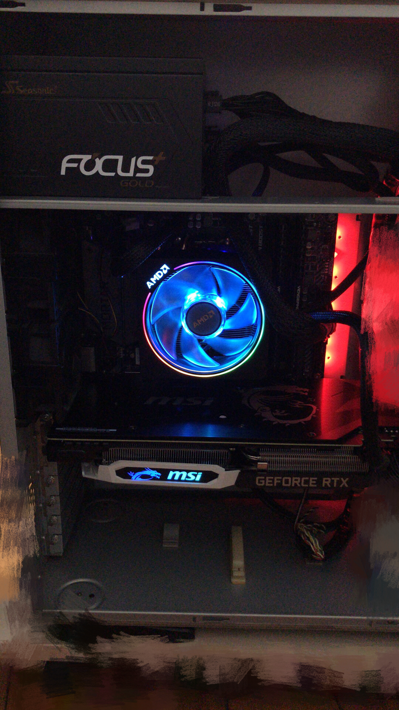

# 万元以下深度学习主机搭建

之前在学习深度学习时，都是用的Google免费300$的GPU服务器。但随着额度马上就快用完了，想组装一台自己的GPU服务器的想法越来越强烈。于是乎，今年年初就决定搭建一台性价比高的GPU服务器。

## 一. 组件购买
以下组件均在某东购买，且都是折后价。

- CPU: AMD 2700X 8核16线程 (2499元，最低价可到2299元)

数据的预处理很依赖CPU，所以核心线程越多越好。

- GPU: 微星 RTX2070 ARMOR (3473元)
- 主板: 微星 B450 MORTAR 迫击炮 (649元)

正好碰上打折，所以GPU主板是一起购买的。GPU是丐中丐版本，不过深度学习为了稳定，一般是不会超频的，所以应该也够用了。[RTX2070据说是深度学习中性价比最高的了。](https://zhuanlan.zhihu.com/p/42749496)

- SSD: 西部数据 黑盘 M.2(NVMe) 500G (799元)

本来想省点钱买250G的，不过一想大点的空间也可以当作数据盘，决定一步到位！

- 内存: 美商海盗船 复仇者 DDR4 3000 16GB $\times$ 2 (1673元)

内存可以说是很重要的部分了，内存小的痛懂得都懂XD

- 电源: 海韵 FOCUS+ 650W (644元)

电源随便找一家大厂商买一般都不会错，正好碰上打折就入手这款了。

- 机箱: 打算先拿家里十年前的联想OEM机箱顶一顶，哈哈。(0元)
- 显示器: 家里也有，而且对显示器的要求不高。(0元)

价钱总共是9737元。

最后上一张全家福。

## 二. 电脑组装
我也是第一次组装电脑，参考的是[这里](https://www.youtube.com/watch?v=IhX0fOUYd8Q)。

按步骤来一步一步安装，应该是没有问题的。安装也是一次点亮。

鲁大师评分:

## 三. GPU环境配置

主要参考了两篇文章：
1. [Ubuntu18.04深度学习GPU环境配置](https://blog.csdn.net/weixin_41863685/article/details/80303963)
2. [How to install TensorFlow with GPU support on Ubuntu 18.04 LTS + CUDA 10](https://medium.com/@cjanze/how-to-install-tensorflow-with-gpu-support-on-ubuntu-18-04-lts-with-cuda-10-nvidia-gpu-312a693744b5)

配置的时候也是使用了Ubuntu 18.04 LTS + CUDA 10，但是之后在测试的时候发现无论是python3.7还是python3.6都不能顺利跑起来。最后不得不又装回CUDA 9.2。

另一个遇到的问题是在删除旧的nouveau nvidia驱动，然后装新的驱动时，如果先卸载再安装，我的显示器会不能很好的显示画面。所以我是先安装，再禁用原来的驱动。

## 四. 云服务器配置

我的服务器放在家里，平时要使用的话当然得通过云端连接。然而家里的网络是一个内网中的内网，本来想通过DDNS内网穿透的，结果好像不行。最后选择了`zerotier`这个APP，好处是配置非常方便，如果有一台国内的服务器做跳板的话，速度也不错。当然还可以选择花生壳、ngrok等等。

配置安装参考的是[这篇](http://einverne.github.io/post/2018/06/zerotier.html)。

## 五. 结语

到此，我们的深度学习主机搭建就结束了。有任何问题欢迎随时提问。

如果文章有帮到你的话，可以帮忙点个赞～

